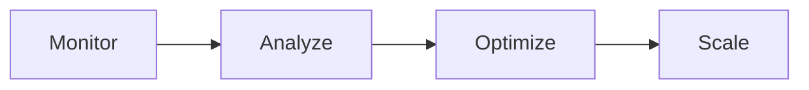

# Workflow Management System

## Overview

This document defines the comprehensive workflow management system for the Cecelia ecosystem, integrating N8N workflows with Brain's intelligent task scheduling.

## Workflow Classification

### 1. By Trigger Type

#### Event-Driven Workflows
- **Webhook Triggered**: External events (GitHub, Notion, etc.)
- **Callback Triggered**: Task completion callbacks
- **State Change Triggered**: Database state changes

#### Time-Based Workflows
- **Scheduled**: Cron-based execution
- **Interval**: Fixed interval execution
- **Delayed**: One-time delayed execution

#### Manual Workflows
- **On-Demand**: User-initiated workflows
- **Brain-Triggered**: AI-scheduled workflows

### 2. By Execution Priority

| Priority | Type | Example | SLA |
|----------|------|---------|-----|
| **P0 - Critical** | System health, security | Health checks, backup | < 1 min response |
| **P1 - High** | Production tasks | Content publishing, data sync | < 5 min response |
| **P2 - Medium** | Development tasks | Code review, testing | < 30 min response |
| **P3 - Low** | Maintenance | Log cleanup, archiving | Best effort |

### 3. By Department

| Department | Prefix | Workflows | Owner |
|------------|--------|-----------|-------|
| **Research** | `RD-` | Development, testing | Spark, Echo |
| **Media** | `MD-` | Content, publishing | 小运, 小析 |
| **Operations** | `OP-` | Monitoring, maintenance | 小维 |
| **Integration** | `IN-` | External APIs, sync | 小通 |

## Workflow Lifecycle

### 1. Development Phase


### 2. Production Phase


### 3. Retirement Phase


## Version Control

### Versioning Scheme
```
{department}-{type}-{name}-v{major}.{minor}.{patch}
```

Example: `RD-AUTO-code-review-v1.2.3`

### Version Rules
- **Major**: Breaking changes, incompatible updates
- **Minor**: New features, backward compatible
- **Patch**: Bug fixes, minor improvements

## Integration with Brain

### 1. Workflow Registration

```javascript
// Register workflow with Brain
const workflow = {
  id: "RD-AUTO-code-review",
  version: "1.2.3",
  triggers: ["pr_created", "manual"],
  priority: "P1",
  timeout: 3600, // seconds
  retry: {
    max: 3,
    backoff: "exponential"
  }
};

await brain.registerWorkflow(workflow);
```

### 2. Dynamic Triggering

```javascript
// Brain decides when to trigger workflows
const decision = await brain.analyzeContext({
  event: "code_pushed",
  repository: "cecelia-core",
  branch: "develop"
});

if (decision.shouldTrigger) {
  await n8n.executeWorkflow(decision.workflowId, decision.parameters);
}
```

### 3. Status Reporting

```javascript
// Workflow reports status back to Brain
const callback = {
  workflowId: "RD-AUTO-code-review",
  executionId: "exec_123",
  status: "completed", // queued, running, completed, failed
  result: {
    issues: 3,
    suggestions: 5
  }
};

await brain.updateWorkflowStatus(callback);
```

## Monitoring & Observability

### Key Metrics

| Metric | Description | Alert Threshold |
|--------|-------------|-----------------|
| **Execution Time** | Workflow duration | > 2x average |
| **Success Rate** | Successful completions | < 95% |
| **Queue Depth** | Pending workflows | > 100 |
| **Error Rate** | Failed executions | > 5% |
| **Resource Usage** | CPU/Memory usage | > 80% |

### Logging Standards

```json
{
  "timestamp": "2024-02-15T10:30:00Z",
  "workflowId": "RD-AUTO-code-review",
  "executionId": "exec_123",
  "level": "info",
  "event": "workflow_started",
  "context": {
    "trigger": "webhook",
    "source": "github",
    "parameters": {}
  }
}
```

## Error Handling

### Retry Strategy

| Error Type | Retry Policy | Max Attempts |
|------------|--------------|--------------|
| **Transient** | Exponential backoff | 3 |
| **Rate Limit** | Fixed delay (60s) | 5 |
| **Timeout** | Immediate | 2 |
| **Permanent** | No retry | 0 |

### Quarantine Rules

Workflows are quarantined when:
- Failed 5 times consecutively
- Execution time > 10x average
- Resource usage > limits
- Security violations detected

## Security & Compliance

### Access Control

| Role | Permissions | Scope |
|------|-------------|-------|
| **Admin** | All operations | All workflows |
| **Developer** | CRUD, execute | Own department |
| **Operator** | Execute, monitor | Assigned workflows |
| **Viewer** | Read only | All workflows |

### Secret Management

- Secrets stored in environment variables
- Rotated every 90 days
- Encrypted at rest
- Audit logging enabled

## Deployment Pipeline

### 1. Local Development
```bash
# Test locally
npm run test:workflow RD-AUTO-code-review

# Validate schema
npm run validate:workflow
```

### 2. Staging
```bash
# Deploy to staging
./deploy/deploy-workflow.sh staging RD-AUTO-code-review

# Run integration tests
npm run test:integration
```

### 3. Production
```bash
# Deploy to production with approval
./deploy/deploy-workflow.sh production RD-AUTO-code-review --require-approval

# Monitor deployment
npm run monitor:deployment
```

## Best Practices

### Do's
- ✅ Version all workflows
- ✅ Document input/output schemas
- ✅ Implement proper error handling
- ✅ Add comprehensive logging
- ✅ Test with edge cases
- ✅ Monitor performance metrics
- ✅ Use secrets management
- ✅ Follow naming conventions

### Don'ts
- ❌ Hardcode credentials
- ❌ Skip testing
- ❌ Ignore errors
- ❌ Create infinite loops
- ❌ Exceed resource limits
- ❌ Bypass security checks
- ❌ Mix environments
- ❌ Delete without archiving

## Workflow Templates

See `/templates` directory for:
- Basic webhook handler
- Scheduled job template
- Data processing pipeline
- External API integration
- Error handler workflow
- Monitoring workflow

## Maintenance Schedule

| Task | Frequency | Owner |
|------|-----------|-------|
| Review inactive workflows | Weekly | Team Lead |
| Update dependencies | Monthly | DevOps |
| Audit permissions | Quarterly | Security |
| Archive old workflows | Quarterly | Operations |
| Performance review | Monthly | SRE |

## Contact & Support

- **Workflow Issues**: Create issue in cecelia-workflows repo
- **Emergency**: Contact Brain operator via Cecelia
- **Documentation**: See /docs directory
- **Templates**: See /templates directory