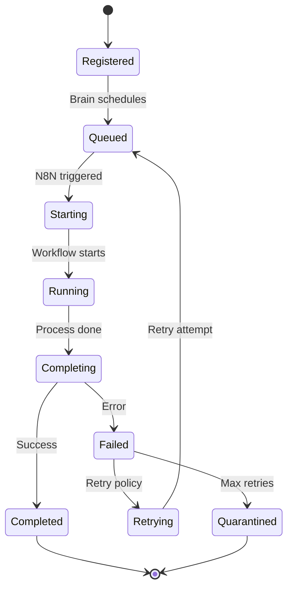

# Brain Integration Architecture

## Overview

This document describes how workflows integrate with Cecelia Brain for intelligent task scheduling and execution management.

## Integration Points

### 1. Workflow Registration

All workflows must register with Brain to be eligible for automated scheduling:

```javascript
POST /api/brain/workflows/register
{
  "id": "RD-AUTO-code-review",
  "name": "Code Review Automation",
  "version": "1.2.3",
  "department": "research",
  "triggers": ["webhook", "brain"],
  "priority": "P1",
  "timeout": 3600,
  "retry": {
    "max": 3,
    "backoff": "exponential"
  },
  "requirements": {
    "resources": {
      "cpu": "low",
      "memory": "medium"
    },
    "dependencies": ["git", "claude-code"]
  }
}
```

### 2. Task Dispatch

Brain decides when to trigger workflows based on:
- Task queue state
- Resource availability
- Priority scoring
- Dependency readiness

```javascript
// Brain's decision process
const decision = await brain.analyzeTask({
  task: currentTask,
  availableWorkflows: registeredWorkflows,
  systemResources: getCurrentResources()
});

if (decision.shouldExecute) {
  await n8n.executeWorkflow(decision.workflowId, {
    taskId: currentTask.id,
    parameters: decision.parameters,
    timeout: decision.timeout
  });
}
```

### 3. Execution Callbacks

Workflows report their status back to Brain at key points:

#### Start Callback
```javascript
POST /api/brain/execution-callback
{
  "workflowId": "RD-AUTO-code-review",
  "executionId": "exec_123",
  "taskId": "task_456",
  "status": "started",
  "timestamp": "2024-02-15T10:00:00Z"
}
```

#### Progress Callback
```javascript
POST /api/brain/execution-callback
{
  "workflowId": "RD-AUTO-code-review",
  "executionId": "exec_123",
  "taskId": "task_456",
  "status": "in_progress",
  "progress": 50,
  "message": "Analyzing code patterns",
  "timestamp": "2024-02-15T10:05:00Z"
}
```

#### Completion Callback
```javascript
POST /api/brain/execution-callback
{
  "workflowId": "RD-AUTO-code-review",
  "executionId": "exec_123",
  "taskId": "task_456",
  "status": "completed",
  "result": {
    "issues": 3,
    "suggestions": 5,
    "approved": false
  },
  "metrics": {
    "duration": 300,
    "resourceUsage": {
      "cpu": "25%",
      "memory": "512MB"
    }
  },
  "timestamp": "2024-02-15T10:10:00Z"
}
```

#### Error Callback
```javascript
POST /api/brain/execution-callback
{
  "workflowId": "RD-AUTO-code-review",
  "executionId": "exec_123",
  "taskId": "task_456",
  "status": "failed",
  "error": {
    "code": "TIMEOUT",
    "message": "Execution exceeded maximum time",
    "details": {}
  },
  "timestamp": "2024-02-15T10:15:00Z"
}
```

## Workflow Lifecycle in Brain

### State Machine



### Database Schema

Workflows are tracked in PostgreSQL:

```sql
-- Workflow executions table
CREATE TABLE workflow_executions (
    id UUID PRIMARY KEY DEFAULT gen_random_uuid(),
    workflow_id VARCHAR(100) NOT NULL,
    task_id UUID REFERENCES tasks(id),
    execution_id VARCHAR(100) UNIQUE,
    status VARCHAR(50) NOT NULL,
    started_at TIMESTAMP,
    completed_at TIMESTAMP,
    result JSONB,
    error JSONB,
    metrics JSONB,
    retry_count INTEGER DEFAULT 0,
    created_at TIMESTAMP DEFAULT CURRENT_TIMESTAMP,
    updated_at TIMESTAMP DEFAULT CURRENT_TIMESTAMP
);

-- Workflow registry table
CREATE TABLE workflow_registry (
    id VARCHAR(100) PRIMARY KEY,
    name VARCHAR(255) NOT NULL,
    version VARCHAR(20) NOT NULL,
    department VARCHAR(50),
    triggers TEXT[],
    priority VARCHAR(10),
    config JSONB,
    active BOOLEAN DEFAULT true,
    created_at TIMESTAMP DEFAULT CURRENT_TIMESTAMP,
    updated_at TIMESTAMP DEFAULT CURRENT_TIMESTAMP
);
```

## Priority Scoring

Brain uses a multi-factor scoring system to prioritize workflow execution:

```javascript
function calculatePriority(task, workflow) {
  let score = 0;

  // Base priority
  const priorityWeights = { P0: 1000, P1: 100, P2: 10, P3: 1 };
  score += priorityWeights[task.priority];

  // Age factor (older tasks get boost)
  const ageHours = (Date.now() - task.created_at) / (1000 * 60 * 60);
  score += Math.min(ageHours * 2, 50);

  // Retry penalty (failed tasks get lower priority)
  score -= task.retry_count * 20;

  // Department balance
  const recentExecutions = getRecentExecutions(workflow.department);
  score -= recentExecutions * 5;

  // Resource availability bonus
  if (hasAvailableResources(workflow.requirements)) {
    score += 30;
  }

  return Math.max(score, 0);
}
```

## Resource Management

### Resource Allocation

Brain tracks resource usage to prevent overload:

```javascript
const RESOURCE_LIMITS = {
  concurrent_workflows: 10,
  cpu_percent: 80,
  memory_gb: 8,
  api_calls_per_minute: 100
};

function canExecuteWorkflow(workflow) {
  const current = getCurrentResourceUsage();

  return (
    current.workflows < RESOURCE_LIMITS.concurrent_workflows &&
    current.cpu + workflow.requirements.cpu < RESOURCE_LIMITS.cpu_percent &&
    current.memory + workflow.requirements.memory < RESOURCE_LIMITS.memory_gb
  );
}
```

### Throttling

Brain implements intelligent throttling:

- **Per-department limits**: No department can use >50% of resources
- **API rate limiting**: Respect external API limits
- **Time-based scheduling**: Defer non-critical tasks to off-peak hours
- **Circuit breaker**: Temporarily disable failing workflows

## Monitoring & Alerting

### Key Metrics

| Metric | Description | Alert Threshold |
|--------|-------------|-----------------|
| workflow_queue_depth | Pending workflows | > 50 |
| workflow_success_rate | Success percentage | < 90% |
| avg_execution_time | Average duration | > 2x baseline |
| resource_utilization | CPU/Memory usage | > 80% |
| retry_rate | Retry percentage | > 10% |
| quarantine_count | Quarantined workflows | > 5 |

### Health Checks

Brain performs regular health checks:

```javascript
// Health check endpoint
GET /api/brain/workflows/health

Response:
{
  "status": "healthy",
  "metrics": {
    "active_workflows": 3,
    "queued_workflows": 12,
    "success_rate_24h": 0.95,
    "avg_execution_time": 120,
    "resource_usage": {
      "cpu": "45%",
      "memory": "3.2GB"
    }
  },
  "issues": []
}
```

## Security

### Authentication

All workflow-Brain communication uses API keys:

```javascript
// N8N → Brain
headers: {
  'X-Brain-API-Key': process.env.BRAIN_API_KEY,
  'X-Workflow-ID': 'RD-AUTO-code-review'
}
```

### Authorization

Workflows can only:
- Update their own execution status
- Access tasks assigned to them
- Read public configuration

### Audit Logging

All workflow actions are logged:

```sql
CREATE TABLE workflow_audit_log (
    id UUID PRIMARY KEY DEFAULT gen_random_uuid(),
    workflow_id VARCHAR(100),
    action VARCHAR(50),
    actor VARCHAR(100),
    details JSONB,
    ip_address INET,
    timestamp TIMESTAMP DEFAULT CURRENT_TIMESTAMP
);
```

## Failure Handling

### Retry Strategies

| Error Type | Strategy | Max Attempts | Backoff |
|------------|----------|--------------|---------|
| Transient | Retry immediately | 3 | None |
| Rate Limit | Delay retry | 5 | Fixed 60s |
| Timeout | Increase timeout | 2 | Double timeout |
| Resource | Wait for resources | 10 | Exponential |
| Permanent | No retry | 0 | N/A |

### Quarantine Rules

Workflows are quarantined when:

1. **Consecutive failures**: 5 failures in a row
2. **High error rate**: >50% errors in 1 hour
3. **Resource abuse**: Exceeds limits 3 times
4. **Security violation**: Any security issue
5. **Manual quarantine**: Admin decision

### Recovery Process

```javascript
// Manual recovery from quarantine
POST /api/brain/workflows/recover
{
  "workflowId": "RD-AUTO-code-review",
  "reason": "Issue resolved, dependency fixed",
  "authorizedBy": "admin"
}
```

## Best Practices

### For Workflow Developers

1. **Always send callbacks** - Start, progress, and completion
2. **Handle errors gracefully** - Catch and report all errors
3. **Respect timeouts** - Complete within allocated time
4. **Clean up resources** - Release resources on completion
5. **Version properly** - Use semantic versioning
6. **Document dependencies** - List all requirements
7. **Test thoroughly** - Include error scenarios

### For Brain Operators

1. **Monitor queue depth** - Prevent backup
2. **Balance departments** - Fair resource allocation
3. **Review quarantined** - Fix root causes
4. **Optimize scheduling** - Use off-peak hours
5. **Scale resources** - Add capacity before limits
6. **Audit regularly** - Check for anomalies
7. **Update documentation** - Keep current

## Integration Checklist

Before deploying a new workflow:

- [ ] Workflow registered with Brain
- [ ] Callbacks implemented (start, complete, error)
- [ ] Timeout configured appropriately
- [ ] Retry policy defined
- [ ] Resource requirements specified
- [ ] Error handling tested
- [ ] Documentation updated
- [ ] Version bumped
- [ ] Integration tests passed
- [ ] Monitoring configured