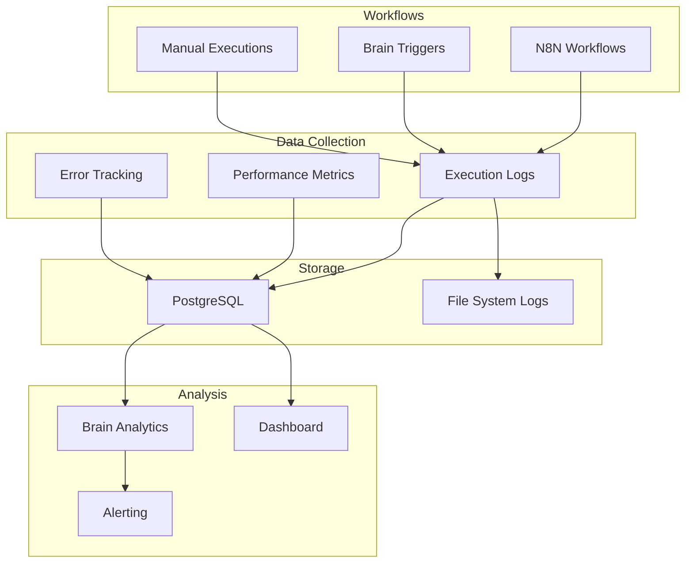

# Workflow Monitoring & Logging Setup

## Overview

This document describes the monitoring and logging infrastructure for Cecelia workflows, providing real-time visibility into workflow execution, performance metrics, and system health.

## Architecture



## Logging Standards

### Log Format

All workflow logs follow a structured format:

```json
{
  "timestamp": "2024-02-15T10:30:00.000Z",
  "level": "info|warn|error|debug",
  "workflow": {
    "id": "RD-AUTO-code-review",
    "name": "Code Review Automation",
    "version": "1.2.3",
    "executionId": "exec_123"
  },
  "event": "workflow_started|step_completed|workflow_completed|error_occurred",
  "message": "Human-readable description",
  "context": {
    "taskId": "task_456",
    "userId": "user_789",
    "trigger": "webhook|scheduled|manual|brain",
    "department": "research"
  },
  "performance": {
    "duration_ms": 1234,
    "memory_mb": 256,
    "cpu_percent": 25
  },
  "error": {
    "code": "ERROR_CODE",
    "message": "Error description",
    "stack": "Stack trace if available"
  }
}
```

### Log Levels

| Level | Usage | Examples |
|-------|-------|----------|
| **DEBUG** | Detailed execution info | Variable values, function calls |
| **INFO** | Normal operations | Workflow started, step completed |
| **WARN** | Potential issues | Retry needed, slow performance |
| **ERROR** | Failures requiring attention | Connection failed, timeout |

### Log Retention

| Type | Retention | Storage |
|------|-----------|---------|
| Debug logs | 7 days | File system |
| Info logs | 30 days | PostgreSQL |
| Warn logs | 90 days | PostgreSQL |
| Error logs | 1 year | PostgreSQL |
| Metrics | 90 days | PostgreSQL |

## Metrics Collection

### Key Performance Indicators (KPIs)

```sql
-- Workflow execution metrics table
CREATE TABLE workflow_metrics (
    id UUID PRIMARY KEY DEFAULT gen_random_uuid(),
    workflow_id VARCHAR(100) NOT NULL,
    execution_id VARCHAR(100),
    metric_name VARCHAR(100) NOT NULL,
    metric_value NUMERIC,
    metric_unit VARCHAR(50),
    tags JSONB,
    collected_at TIMESTAMP DEFAULT CURRENT_TIMESTAMP,

    INDEX idx_workflow_metrics_time (workflow_id, collected_at),
    INDEX idx_workflow_metrics_name (metric_name, collected_at)
);
```

### Standard Metrics

| Metric | Unit | Description | Alert Threshold |
|--------|------|-------------|-----------------|
| execution_time | seconds | Total workflow duration | > 2x average |
| step_duration | seconds | Individual step time | > 60 seconds |
| memory_usage | MB | Memory consumption | > 1024 MB |
| cpu_usage | percent | CPU utilization | > 80% |
| error_rate | percent | Failure percentage | > 5% |
| retry_count | count | Number of retries | > 3 |
| queue_depth | count | Waiting workflows | > 50 |
| throughput | per_minute | Workflows completed | < 1 |

## Real-time Monitoring

### Health Check Endpoint

```javascript
// GET /api/workflows/health
{
  "status": "healthy|degraded|unhealthy",
  "timestamp": "2024-02-15T10:30:00Z",
  "checks": {
    "n8n_connection": {
      "status": "healthy",
      "latency_ms": 12
    },
    "brain_connection": {
      "status": "healthy",
      "latency_ms": 8
    },
    "database": {
      "status": "healthy",
      "connections": 5,
      "max_connections": 100
    },
    "workflows": {
      "active": 3,
      "queued": 12,
      "failed_last_hour": 2
    }
  }
}
```

### Live Metrics Stream

```javascript
// WebSocket endpoint for real-time metrics
ws://localhost:5221/api/workflows/metrics/stream

// Message format
{
  "type": "metric",
  "workflow_id": "RD-AUTO-code-review",
  "name": "execution_started",
  "value": 1,
  "timestamp": "2024-02-15T10:30:00Z"
}
```

## Dashboard Configuration

### Grafana Dashboard Panels

1. **Execution Overview**
   - Active workflows
   - Completed today
   - Failed today
   - Average duration

2. **Performance Metrics**
   - Execution time trends
   - Memory usage
   - CPU utilization
   - Queue depth

3. **Error Analysis**
   - Error rate by workflow
   - Error types distribution
   - Retry statistics
   - Quarantined workflows

4. **Department Breakdown**
   - Executions by department
   - Resource usage by department
   - Success rate by department

### Query Examples

```sql
-- Workflow success rate (last 24 hours)
SELECT
    workflow_id,
    COUNT(*) FILTER (WHERE status = 'completed') * 100.0 / COUNT(*) as success_rate
FROM workflow_executions
WHERE created_at >= NOW() - INTERVAL '24 hours'
GROUP BY workflow_id
ORDER BY success_rate ASC;

-- Average execution time by workflow
SELECT
    workflow_id,
    AVG(EXTRACT(EPOCH FROM (completed_at - started_at))) as avg_duration_seconds,
    PERCENTILE_CONT(0.95) WITHIN GROUP (
        ORDER BY EXTRACT(EPOCH FROM (completed_at - started_at))
    ) as p95_duration_seconds
FROM workflow_executions
WHERE status = 'completed'
    AND created_at >= NOW() - INTERVAL '7 days'
GROUP BY workflow_id;

-- Resource usage trends
SELECT
    DATE_TRUNC('hour', collected_at) as hour,
    workflow_id,
    AVG(metric_value) FILTER (WHERE metric_name = 'cpu_usage') as avg_cpu,
    AVG(metric_value) FILTER (WHERE metric_name = 'memory_usage') as avg_memory
FROM workflow_metrics
WHERE collected_at >= NOW() - INTERVAL '24 hours'
GROUP BY hour, workflow_id
ORDER BY hour DESC;
```

## Alerting Rules

### Alert Configuration

```yaml
# Prometheus alerting rules
groups:
  - name: workflow_alerts
    interval: 30s
    rules:
      - alert: WorkflowHighErrorRate
        expr: |
          (
            sum(rate(workflow_errors_total[5m])) by (workflow_id)
            /
            sum(rate(workflow_executions_total[5m])) by (workflow_id)
          ) > 0.1
        for: 5m
        labels:
          severity: warning
        annotations:
          summary: "High error rate for {{ $labels.workflow_id }}"
          description: "Workflow {{ $labels.workflow_id }} has {{ $value | humanizePercentage }} error rate"

      - alert: WorkflowQueueBackup
        expr: workflow_queue_depth > 50
        for: 10m
        labels:
          severity: critical
        annotations:
          summary: "Workflow queue backing up"
          description: "{{ $value }} workflows waiting in queue"

      - alert: WorkflowExecutionTimeout
        expr: |
          (time() - workflow_execution_started_timestamp) > workflow_timeout_seconds
          and workflow_execution_status == "running"
        for: 1m
        labels:
          severity: critical
        annotations:
          summary: "Workflow execution timeout"
          description: "Workflow {{ $labels.workflow_id }} running for {{ $value | humanizeDuration }}"
```

### Alert Channels

| Channel | Used For | Configuration |
|---------|----------|---------------|
| **Brain Callback** | All alerts | POST to /api/brain/alert |
| **Slack** | Critical alerts | #cecelia-alerts channel |
| **Email** | Weekly summaries | team@example.com |
| **PagerDuty** | P0 failures | On-call rotation |

## Log Aggregation

### Centralized Logging

```bash
# Log file locations
/var/log/cecelia/workflows/
├── execution/
│   ├── 2024-02-15/
│   │   ├── RD-AUTO-code-review.log
│   │   └── MD-PUBLISH-content.log
├── errors/
│   └── 2024-02-15-errors.log
└── metrics/
    └── 2024-02-15-metrics.log
```

### Log Rotation

```bash
# /etc/logrotate.d/cecelia-workflows
/var/log/cecelia/workflows/*/*.log {
    daily
    rotate 30
    compress
    delaycompress
    notifempty
    create 0640 cecelia cecelia
    sharedscripts
    postrotate
        # Signal to reopen log files
        systemctl reload cecelia-workflows
    endscript
}
```

## Performance Optimization

### Query Optimization

```sql
-- Create indexes for common queries
CREATE INDEX idx_workflow_exec_status_time
    ON workflow_executions(status, created_at DESC);

CREATE INDEX idx_workflow_exec_workflow_time
    ON workflow_executions(workflow_id, created_at DESC);

CREATE INDEX idx_workflow_metrics_composite
    ON workflow_metrics(workflow_id, metric_name, collected_at DESC);

-- Partition large tables by time
CREATE TABLE workflow_executions_2024_02
    PARTITION OF workflow_executions
    FOR VALUES FROM ('2024-02-01') TO ('2024-03-01');
```

### Monitoring Query Performance

```sql
-- Find slow queries
SELECT
    query,
    calls,
    total_time,
    mean,
    max
FROM pg_stat_statements
WHERE query LIKE '%workflow%'
ORDER BY mean DESC
LIMIT 10;
```

## Troubleshooting Guide

### Common Issues

| Symptom | Possible Cause | Investigation | Resolution |
|---------|---------------|---------------|------------|
| High error rate | External service down | Check dependencies | Retry with backoff |
| Slow execution | Resource contention | Check CPU/memory | Scale resources |
| Queue backup | Too many triggers | Check trigger rate | Rate limiting |
| Missing logs | Disk full | Check disk space | Clean old logs |
| Metrics gap | Collector down | Check collector status | Restart collector |

### Debug Commands

```bash
# Check workflow status
curl -s http://localhost:5221/api/workflows/status | jq

# View recent errors
curl -s http://localhost:5221/api/workflows/errors?limit=10 | jq

# Get workflow metrics
curl -s http://localhost:5221/api/workflows/metrics/RD-AUTO-code-review | jq

# Tail live logs
tail -f /var/log/cecelia/workflows/execution/$(date +%Y-%m-%d)/*.log

# Check N8N connection
curl -s http://localhost:5679/health | jq
```

## Compliance & Audit

### Audit Requirements

- All workflow executions logged
- User actions tracked
- Configuration changes versioned
- Sensitive data masked
- Logs retained per policy

### Data Privacy

```javascript
// Mask sensitive data in logs
function maskSensitiveData(data) {
  const masked = { ...data };

  // Mask patterns
  const patterns = {
    email: /\b[A-Za-z0-9._%+-]+@[A-Za-z0-9.-]+\.[A-Z|a-z]{2,}\b/g,
    phone: /\b\d{3}[-.]?\d{3}[-.]?\d{4}\b/g,
    ssn: /\b\d{3}-\d{2}-\d{4}\b/g,
    apiKey: /[a-zA-Z0-9]{32,}/g
  };

  Object.values(patterns).forEach(pattern => {
    masked.message = masked.message?.replace(pattern, '***MASKED***');
  });

  return masked;
}
```

## Maintenance Procedures

### Daily Tasks
- Review error logs
- Check queue depth
- Verify health status

### Weekly Tasks
- Analyze performance trends
- Review quarantined workflows
- Update alert thresholds

### Monthly Tasks
- Archive old logs
- Optimize database indexes
- Review capacity planning
- Update documentation